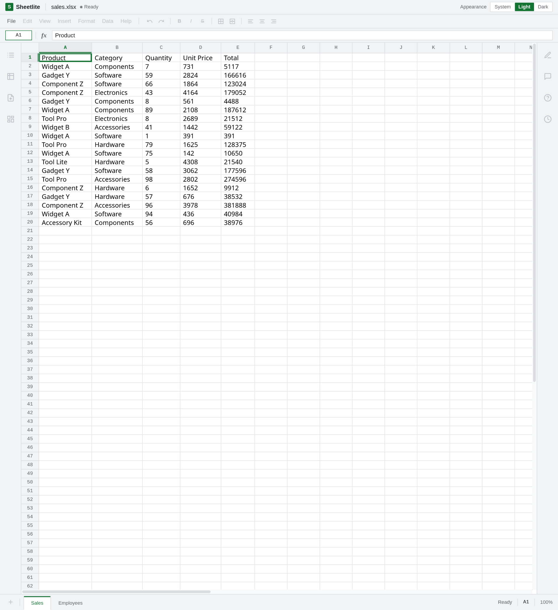
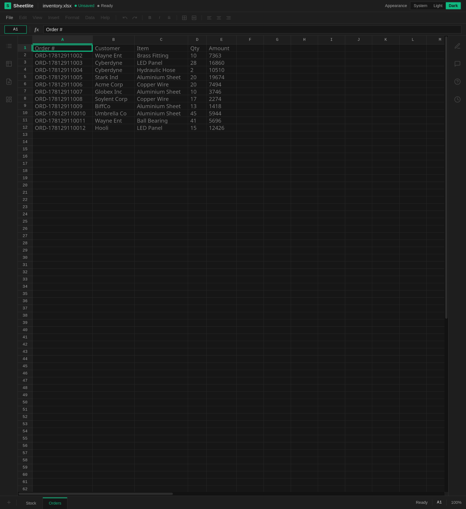

# Sheetlite

Sheetlite is a lightweight, cross-platform desktop app for viewing and editing spreadsheet documents.

## Screenshots





## Features

- Open spreadsheets from the file menu or by drag and drop
- Browse worksheets in a spreadsheet-style grid
- View cell formatting, merged cells, row heights, and column widths
- Edit cell values through the grid or formula bar
- Save changes back to the workbook, or use Save As
- Light, dark, and system appearance modes

## Usage

Open a spreadsheet from the file menu or drag it into the window. Edit cells in the grid or formula bar, then save the workbook or use Save As.

## Development

Requirements:

- Go
- Node.js and pnpm
- Wails CLI

Run the app in development mode:

```sh
wails dev
```

Run tests:

```sh
go test ./...
```

Build a desktop package:

```sh
wails build
```

## Contributing

Contributions are welcome. Keep changes focused, and run tests before opening a pull request.

## Acknowledgements

Sheetlite is built with [Wails](https://wails.io/) for the cross-platform desktop shell and [Excelize](https://github.com/qax-os/excelize) for reading and writing Excel workbooks.

## License

See [LICENSE](LICENSE).
